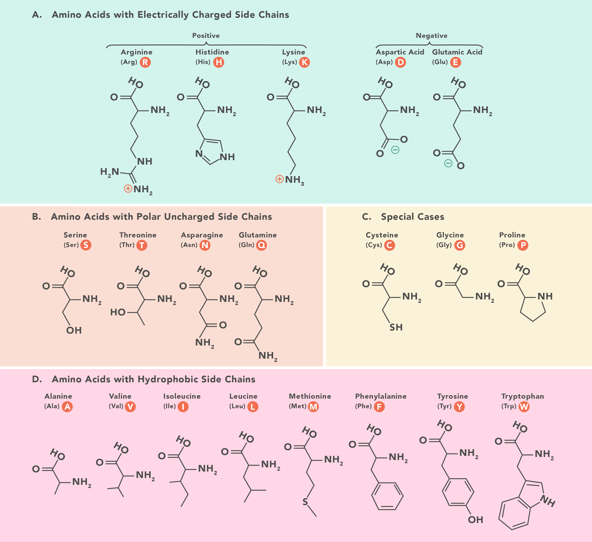
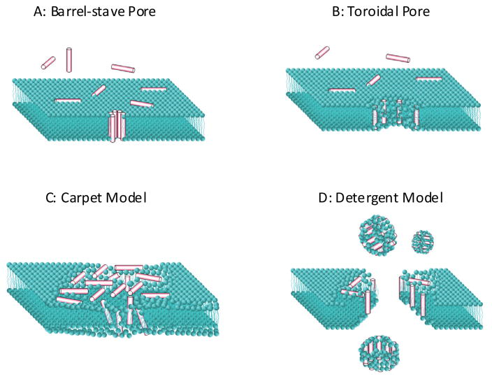
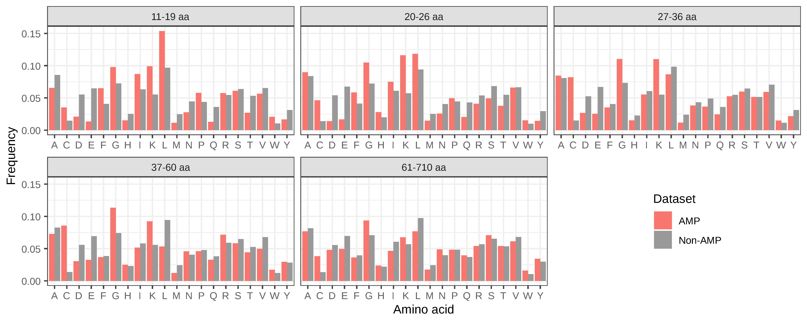
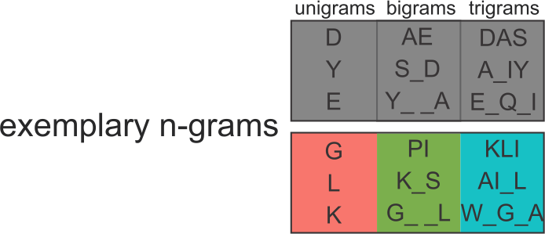
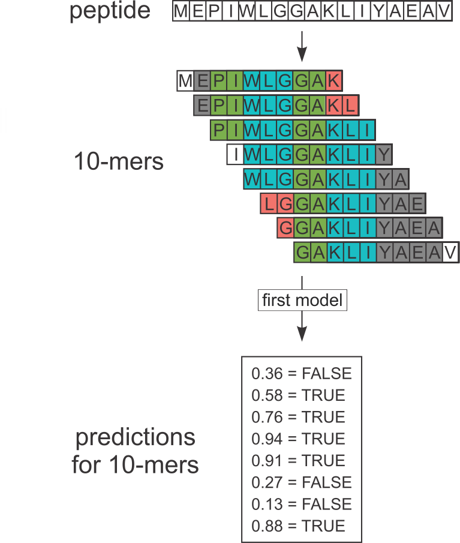
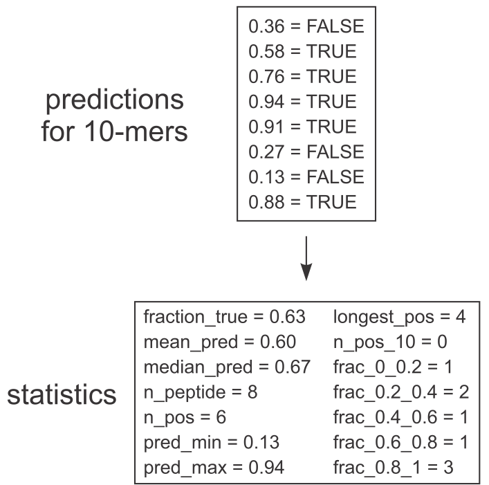
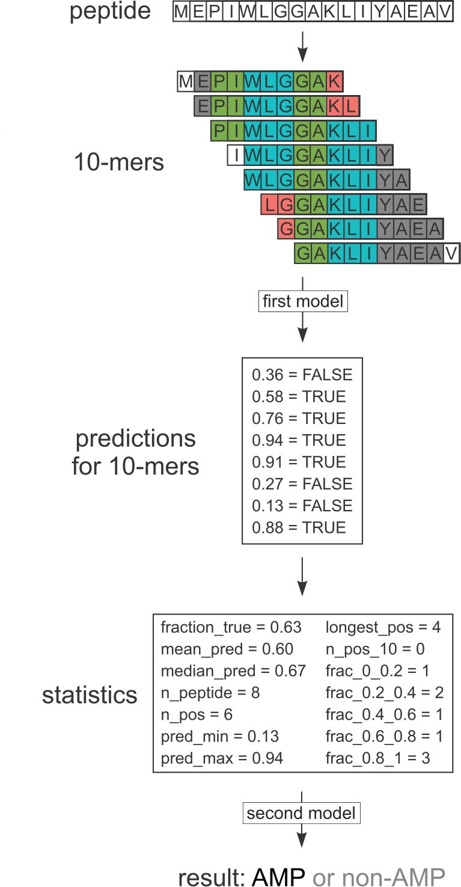
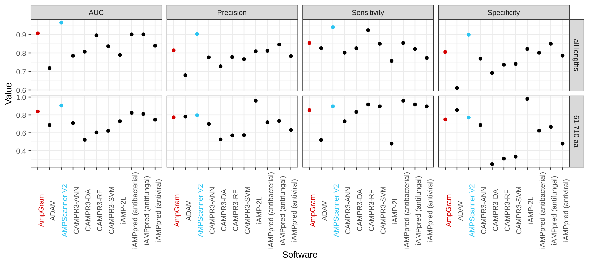
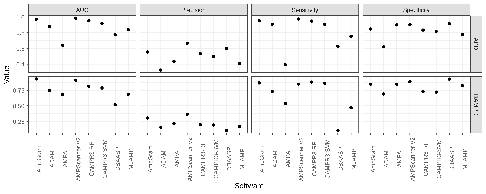
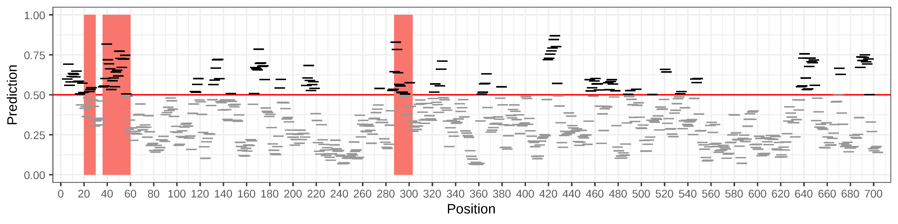

```{r setup, include=FALSE}
knitr::opts_chunk$set(echo = TRUE)
library(dplyr)
library(drake)
library(ranger)
library(biogram)
source("../AmpGram-analysis/functions/raw_data.R")
source("../AmpGram-analysis/functions/cdhit_data.R")
source("../AmpGram-analysis/functions/nonstandard_AMPs.R")
source("../AmpGram-analysis/functions/cutting_seqs.R")
source("../AmpGram-analysis/functions/holdouts.R")
source("../AmpGram-analysis/functions/writing_benchmarks.R")
source("../AmpGram-analysis/functions/get_mers.R")
source("../AmpGram-analysis/functions/count_ampgrams.R")
source("../AmpGram-analysis/functions/do_cv.R")
source("../AmpGram-analysis/functions/train_model_peptides.R")
loadd(c(mer_df, binary_ngrams), path = "../AmpGram-analysis/.drake")
load("../AmpGram-analysis/results/AmpGram_model.rda")
```

## Amino acids and peptides

Peptides consist of 20 standard amino acids encoded by letters.


 
<figcaption>https://www.technologynetworks.com/applied-sciences/articles/essential-amino-acids-chart-abbreviations-and-structure-324357</figcaption>

## What are antimicrobial peptides?

- Short peptides, usually consisting of 5-100 amino acids.
- Widespread in all living organisms.
- Rich in positively charged and hydrophobic residues.
- Able to interact with negatively charged bacterial membranes.
- May display antibacterial, antiviral, antifungal, antiparasitic, anticancer properties.


<figcaption>Wimley WC. Describing the mechanism of antimicrobial peptide action with the interfacial activity model. <br>ACS Chem Biol. 2010 Oct 15;5(10):905-17.</figcaption>


## Existing software and length-score dependency

- There are many AMP prediction algorithms, some accessible as <br>web servers (ADAM, AMPScanner V2, CAMPR3, iAMP-2L, iAMPpred).
- Many classifiers exhibit strong length dependence.




## Positive dataset construction

- 12,389 AMP sequences were downloaded from dbAMP database.
- Sequences containing nonstandard amino acids (B, J, O, U, X, Z) were removed.
- Homology reduction was performed with CD-HIT <br>(0.9 identity cut-off).
- Final dataset consisted of 2463 peptides.


## Negative dataset construction

544,249 sequences from UniProt (experimentally validated, without antimicrobial, antibacterial, antiviral, antifungal activity, and not possesing mitochondrial or plastid transit peptide).


 
 
## Train-test and benchmark datasets
 
- Both positive and negative dataset were divided into five equally sized groups of sequence lengths: 11–19, (ii) 20–26, (iii) 27–36, <br>(iv) 37–60 and (v) 61–710. 
- One tenth of sequences from each group were extracted to create the benchmark dataset (247 AMP and 247 non-AMPs).
- Remaining 2216 sequences in each dataset were used for training and testing.

```{r}
generate_holdout_groups <- function(sequences) {
  seq_length_groups <- cut(lengths(sequences), 
                           breaks = as.numeric(quantile(lengths(sequences), probs = seq(0, 1, 0.2))),
                           include.lowest = TRUE)
  
  names(seq_length_groups) <- names(sequences)
  
  holdout_list <- lapply(levels(seq_length_groups), function(ith_group) {
    peptides_in_group <- names(seq_length_groups)[seq_length_groups == ith_group]
    group_benchmark <- sample(peptides_in_group, round(length(peptides_in_group)*0.10, 0))
    list(benchmark = group_benchmark,
         traintest = setdiff(peptides_in_group, group_benchmark))
  }) 
  
  names(holdout_list) <- levels(seq_length_groups)
  holdout_list
}
```

## Extraction of 10-mers

- All 10-mers from the positive dataset were considered as AMPs, whereas all 10-mers from the negative dataset as non-AMPs.
- 87,716 AMP 10-mers and 87,599 non-AMP 10-mers

```{r}
create_mer_df <- function(seq) 
  do.call(rbind, lapply(1L:nrow(seq), function(i) {
    seq2ngrams(seq[i, ][!is.na(seq[i, ])], 10, a()[-1]) %>% 
      decode_ngrams() %>% 
      unname() %>% 
      strsplit(split = "") %>% 
      do.call(rbind, .) %>% 
      data.frame(stringsAsFactors = FALSE) %>% 
      mutate(source_peptide = rownames(seq)[i],
             mer_id = paste0(source_peptide, "m", 1L:nrow(.)))
  }))

get_mers <- function(pos, pos_id, neg, neg_id) {
  seq_groups <- lapply(names(pos_id), function(i)
    c(pos[pos_id[[i]][["traintest"]]], neg[neg_id[[i]][["traintest"]]])) %>% 
    setNames(names(pos_id))

  lapply(names(seq_groups), function(ith_group_id) {
    ith_group <- seq_groups[[ith_group_id]]
    
    folded <- cvFolds(length(ith_group), K = 5)
    fold_df <- data.frame(source_peptide = names(ith_group)[folded[["subsets"]]], 
                          fold = folded[["which"]],
                          stringsAsFactors = FALSE)
    
    ith_group %>% 
      list2matrix() %>% 
      create_mer_df %>% 
      mutate(group = ith_group_id) %>% 
      inner_join(fold_df, by = c("source_peptide" = "source_peptide"))
  }) %>% 
    do.call(rbind, .) %>% 
    mutate(target = grepl("AMP", source_peptide, fixed = TRUE)) %T>% {
    print(paste0("Number of AMP mers: ", nrow(filter(target == TRUE))))
    print(paste0("Number of non-AMP mers: ", nrow(filter(target == FALSE))))
    }
}  
```

## Extraction of 10-mers

- All 10-mers from the positive dataset were considered as AMPs, whereas all 10-mers from the negative dataset as non-AMPs.
- 87,716 AMP 10-mers and 87,599 non-AMP 10-mers
```{r}
head(mer_df)
```


## Extraction of n-grams

- Extraction of n-grams: unigrams, bigrams (gap length from 1 to 3) and trigrams (single gaps)
- Binarization of n-gram counts



## Extraction of n-grams

```{r}
count_ampgrams <- function(mer_df, ns, ds) {
  
  mer_df[, grep("^X", colnames(mer_df))] %>% 
    as.matrix() %>% 
    count_multigrams(ns = ns, 
                     ds = ds,
                     seq = .,
                     u = toupper(colnames(aaprop))) %>% 
    binarize
}

as.matrix(binary_ngrams[1:10, 15:25])
ncol(binary_ngrams)
```


## Selection of informative n-grams with QuiPT

```{r}
calc_imp_bigrams <- function(train_mer_df, train_binary_ngrams, train_groups, cutoff = 0.05) {
  train_dat <- filter(train_mer_df, group %in% train_groups)
  test_bis <- test_features(train_dat[["target"]],
                            train_binary_ngrams[train_mer_df[["group"]] %in% train_groups, ])
  imp_bigrams <- cut(test_bis, breaks = c(0, cutoff, 1))[[1]]
  imp_bigrams
}

head(AmpGram_model[["imp_features"]], 50)
```

## Model training: prediction for 10-mers

- 5-fold cross-validation was performed using different length groups.
- Peptides of lengths 11-26 yielded the best results <br>(893 AMPs and non-AMPs, 8791 AMP and 8818 non-AMP 10-mers).
- Training data: 13,087 most informative n-grams selected by QuiPT.
- Random forest was grown with 2000 trees and default mtry parameter using ranger R package.



## Model training: prediction for 10-mers

```{r}
train_model_mers <- function(train_mer_df, train_groups, train_binary_ngrams, imp_bigrams) {
  train_dat <- filter(train_mer_df, group %in% train_groups)
  ranger_train_data <- data.frame(as.matrix(train_binary_ngrams[train_mer_df[["group"]] %in% train_groups, imp_bigrams]),
                                  tar = as.factor(train_dat[["target"]]))
  
  model_full_alphabet <- ranger(dependent.variable.name = "tar", data = ranger_train_data, 
                                write.forest = TRUE, probability = TRUE, num.trees = 2000, 
                                verbose = FALSE, seed = 990)
  model_full_alphabet
}

AmpGram_model[["rf_mers"]]
```


## Calculation of statistics for peptides

- 14 statistics were used to describe 10-mer predictions <br>for each peptide

```{r}
calculate_statistics <- function(pred_mers) {
  (if("fold" %in% colnames(pred_mers)) {
    group_by(pred_mers, source_peptide, target, fold)
  } else {  
    group_by(pred_mers, source_peptide, target)
  }) %>% 
    summarise(fraction_true = mean(pred > 0.5),
              pred_mean = mean(pred),
              pred_median = median(pred),
              n_peptide = length(pred),
              n_pos = sum(pred > 0.5),
              pred_min = min(pred),
              pred_max = max(pred), 
              longest_pos = max(count_longest(pred)),
              n_pos_10 = sum(count_longest(pred) >= 10),
              frac_0_0.2 = sum(pred <= 0.2)/n(),
              frac_0.2_0.4 = sum(pred > 0.2 & pred <= 0.4)/n(),
              frac_0.4_0.6 = sum(pred > 0.4 & pred <= 0.6)/n(),
              frac_0.6_0.8 = sum(pred > 0.6 & pred <= 0.8)/n(),
              frac_0.8_1 = sum(pred > 0.8 & pred <= 1)/n()) %>% 
    ungroup() %>% 
    mutate(target = factor(target))
}

```

## Model training: prediction for whole peptides

- Second random forest model was trained on these statistics <br>(500 trees, default mtry)



## Model training: prediction for whole peptides

```{r}
train_model_peptides <- function(mer_statistics) {
  train_dat <- mer_statistics %>% 
    select(c("target", "fraction_true", "pred_mean", "pred_median",
             "n_peptide", "n_pos", "pred_min", "pred_max", "longest_pos",
             "n_pos_10", "frac_0_0.2", "frac_0.2_0.4", "frac_0.4_0.6",
             "frac_0.6_0.8", "frac_0.8_1"))
  model <- ranger(dependent.variable.name = "target", data = train_dat, 
                     write.forest = TRUE, probability = TRUE, num.trees = 500, 
                     verbose = FALSE, classification = TRUE, seed = 990)
  model
}

AmpGram_model[["rf_peptides"]]
```


## Final algorithm structure





## Benchmark on our dataset

Dataset consisted of 247 AMPs and 247 non-AMPs




## Benchmark on Gabere and Noble's datasets

- Datasets were acquired from Gabere MN, Noble WS. Empirical comparison of web-based antimicrobial peptide prediction tools. Bioinformatics. 2017;33(13):1921-1929.
- APD dataset: 1713 AMPs and 8565 non-AMPs
- DAMPD dataset: 547 AMPs and 2735 non-AMPs
- DAMPD dataset was modified by removing 336 AMP sequences used to train AmpGram or AMPScanner.




## Prediction of experimentally validated antimicrobial regions in lactoferrin

- 11 amino acid N-terminal fragment
- Lactoferricin: 17-41
- Lactoferrampin: 268–284


 
## Availability

- Web server: [biongram.biotech.uni.wroc.pl/AmpGram](biongram.biotech.uni.wroc.pl/AmpGram)
- R package: https://CRAN.R-project.org/package=AmpGram

## Usage - prediction

```{r}
library(AmpGram)
library(AmpGramModel)

sequences <- read_fasta("../AmpGram/inst/AmpGram/prots.txt")
sequences

preds <- predict(AmpGram_model, sequences)
preds

```
 
## Usage - summarizing predictions
 
```{r}
pred2df(preds)

get_AMPs(preds[[1]])

```
 
## For more information...
 
- Paper: Burdukiewicz, M., Sidorczuk, K., Rafacz, D., Pietluch, F., Chilimoniuk, J., Rödiger, S. and Gagat, P. <br>AmpGram: a proteome screening tool for prediction and design of antimicrobial peptides. Int. J. Mol. Sci. 2020, 21(12), 4310.
- Code used for the analysis: <br>https://github.com/michbur/AmpGram-analysis 