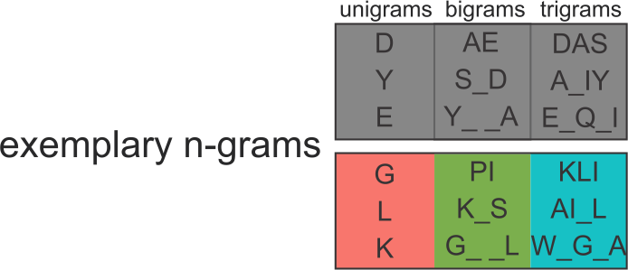

```{r setup, include=FALSE}
knitr::opts_chunk$set(echo = TRUE, message = FALSE)
```

## Amino acids and peptides

Peptides consist of 20 standard amino acids encoded by letters.


 
<figcaption>https://www.technologynetworks.com/applied-sciences/articles/essential-amino-acids-chart-abbreviations-and-structure-324357</figcaption>

## What are antimicrobial peptides?

- Short peptides, usually consisting of 5-100 amino acids.
- Widespread in all living organisms.
- Rich in positively charged and hydrophobic residues.
- Able to interact with negatively charged bacterial membranes.
- May display antibacterial, antiviral, antifungal, antiparasitic, anticancer properties.


<figcaption>Wimley WC. Describing the mechanism of antimicrobial peptide action with the interfacial activity model. <br>ACS Chem Biol. 2010 Oct 15;5(10):905-17.</figcaption>


## Existing software and length-score dependency

- There are many AMP prediction algorithms, some accessible as <br>web servers (ADAM, AMPScanner V2, CAMPR3, iAMP-2L, iAMPpred).
- Many classifiers exhibit strong length dependence.


## Prediction of antimicrobial peptides with AmpGram


## Positive dataset construction

- 12,389 AMP sequences were downloaded from dbAMP database.
- Sequences containing nonstandard amino acids (B, J, O, U, X, Z) were removed.
- Homology reduction was performed with CD-HIT <br>(0.9 identity cut-off).
- Final dataset consisted of 2463 peptides.


## Negative dataset construction

544,249 sequences from UniProt (experimentally validated, without antimicrobial, antibacterial, antiviral, antifungal activity, and not possesing mitochondrial or plastid transit peptide).


 
 
## Train-test and benchmark datasets
 
- Both positive and negative dataset were divided into five equally sized groups of sequence lengths: 11–19, (ii) 20–26, (iii) 27–36, <br>(iv) 37–60 and (v) 61–710. 
- One tenth of sequences from each group were extracetd to create the benchmark dataset (247 AMP and 247 non-AMPs).
- Remaining 2216 sequences in each dataset were used for training and testing.


## Extraction of n-grams

- All 10-mers from the positive dataset were considered as AMPs, whereas all 10-mers from the negative dataset as non-AMPs.
- 87,716 AMP 10-mers and 87,599 non-AMP 10-mers
- Extraction of n-grams: unigrams, bigrams (gap length from 1 to 3) and trigrams (single gaps)
- Binarization of n-gram counts




## Model training: prediction for 10-mers

- 5-fold cross-validation was performed using different length groups.
- Peptides of lengths 11-26 yielded the best results <br>(893 AMPs and non-AMPs, 8791 AMP and 8818 non-AMP 10-mers).
- Training data: 13,087 most informative n-grams selected by QuiPT.
- Random forest was grown with 2000 trees and default mtry parameter using ranger R package.


## Model training: prediction for whole peptides

- 14 statistics were used to describe 10-mer predictions <br>for each peptide
- Second random forest model was trained on these statistics <br>(500 trees, default mtry)


## Model training: prediction for whole peptides


## Benchmark on our dataset

Dataset consisted of 247 AMPs and 247 non-AMPs


## Benchmark on Gabere and Noble's datasets

- Datasets were acquired from Gabere MN, Noble WS. Empirical comparison of web-based antimicrobial peptide prediction tools. Bioinformatics. 2017;33(13):1921-1929.
- APD dataset: 1713 AMPs and 8565 non-AMPs
- DAMPD dataset: 547 AMPs and 2735 non-AMPs
- DAMPD dataset was modified by removing 336 AMP sequences used to train AmpGram or AMPScanner.


## Prediction of experimentally validated antimicrobial regions in lactoferrin

- 11 amino acid N-terminal fragment
- Lactoferricin: 17-41
- Lactoferrampin: 268–284


 
 
## Availability

- Web server: [biongram.biotech.uni.wroc.pl/AmpGram](biongram.biotech.uni.wroc.pl/AmpGram)
- R package: https://CRAN.R-project.org/package=AmpGram
 
 
## For more information...
 
- Paper: Burdukiewicz, M., Sidorczuk, K., Rafacz, D., Pietluch, F., Chilimoniuk, J., Rödiger, S. and Gagat, P. <br>AmpGram: a proteome screening tool for prediction and design of antimicrobial peptides. Int. J. Mol. Sci. 2020, 21(12), 4310.

