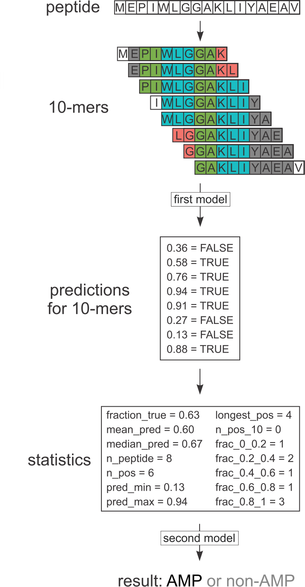
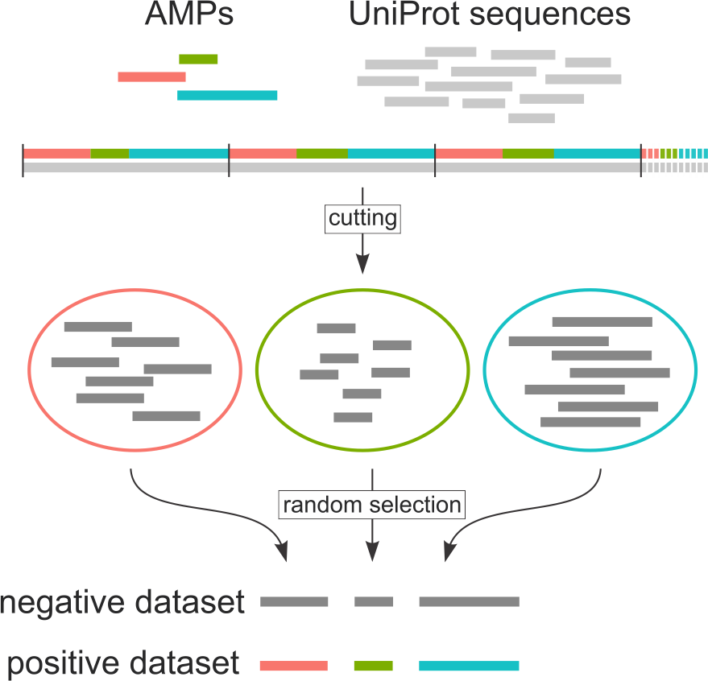
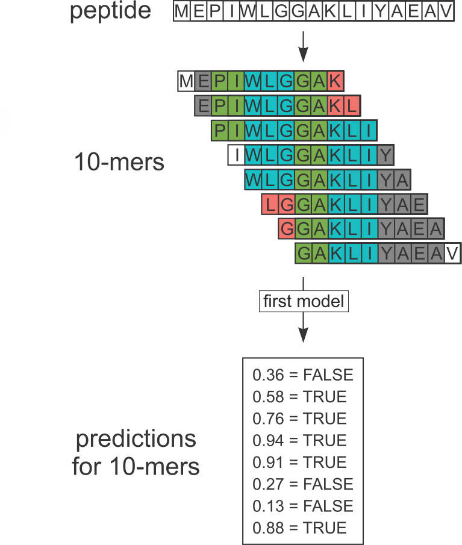
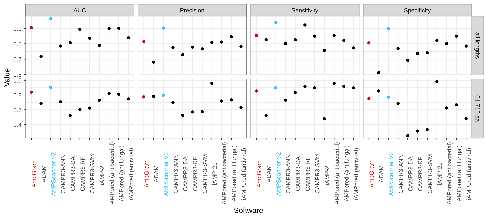
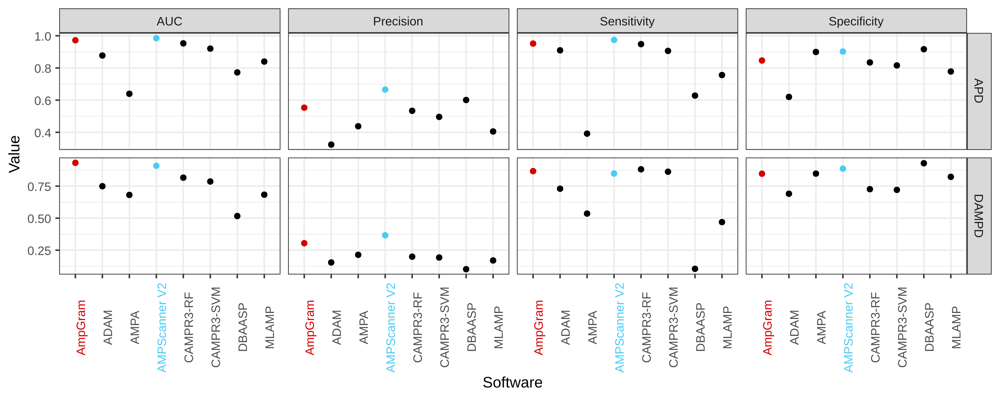

```{r setup, include=FALSE}
knitr::opts_chunk$set(echo = TRUE)
```

## Amino acids and peptides

- Peptides consist of 20 amino acids 
- Amino acids are encoded by letters


## What are antimicrobial peptides?

- Short peptides, usually consisting of 5-100 amino acids
- Host defense peptides widespread in all living organisms
- Rich in positively charged and hydrophobic residues
- Able to interact with negatively charged bacterial membranes
- May display antibacterial, antiviral, antifungal, antiparasitic, anticancer properties


## Existing software and length-score dependency

- There are many AMP prediction algorithms, some accessible as web servers.
- Many classifiers exhibit stong length dependence.


## Existing software and length-score dependency

- There are many AMP prediction algorithms, some accessible as web servers.
- Many classifiers exhibit stong length dependence.


## Prediction of antimicrobial peptides with AmpGram




## Positive dataset construction

- 12,389 AMP sequences were downloaded from dbAMP database.
- Sequences containing nonstandard amino acids (B, J, O, U, X, Z) were removed.
- Homology reduction was performed with CD-HIT (0.9 identity cut-off).
- Final dataset consisted of 2463 peptides.


## Negative dataset construction

544,249 sequences from UniProt (experimentally validated, without antimicrobial, antibacterial, antiviral, antifungal activity, and not possesing mitochondrial or plastid transit peptide).


 
 
## Train-test and benchmark datasets
 
- Both positive and negative dataset were divided into five equally sized groups of sequence lengths: 11–19, (ii) 20–26, (iii) 27–36, (iv) 37–60 and (v) 61–710. 
- One tenth of sequences from each group were extracetd to create the benchmark dataset (247 AMP and 247 non-AMPs).
- Remaining 2216 sequences in each dataset were used for training and testing.


## Extraction of n-grams

- All 10-mers from the positive dataset were considered as AMPs, whereas all 10-mers from the negative dataset as non-AMPs.
- 87,716 AMP 10-mers and 87,599 non-AMP 10-mers
- Extraction of n-grams: unigrams, bigrams (with a gap length from 1 to 3) and trigrams (single gap between the first and the second or the second and the third position)
- Binarization of n-gram counts


## Model training: prediction for 10-mers

- 5-fold cross-validation was performed using different length groups.
- Peptides of lengths 11-26 yielded the best results (893 AMPs and non-AMPs, 8791 AMP and 8818 non-AMP 10-mers).
- Training data: 13,087 most informative n-grams selected by QuiPT.
- Random forest was grown with 2000 trees and default mtry parameter using ranger R package.



## Model training: prediction for whole peptides

- 14 statistics were used to describe 10-mer predictions for each peptide
- Second random forest model was trained on these statistics (500 trees, default mtry)


## Model training: prediction for whole peptides


## Benchmark on our dataset

Dataset consisted of 247 AMPs and 247 non-AMPs




## Benchmark on Gabere and Noble's datasets

DAMPD dataset was modified by removing sequences used to train AmpGram or AMPScanner.




## Prediction of experimentally validated antimicrobial regions in lactoferrin

- 11 amino acid N-terminal fragment
- Lactoferricin: 17-41
- Lactoferrampin: 268–284


 
 